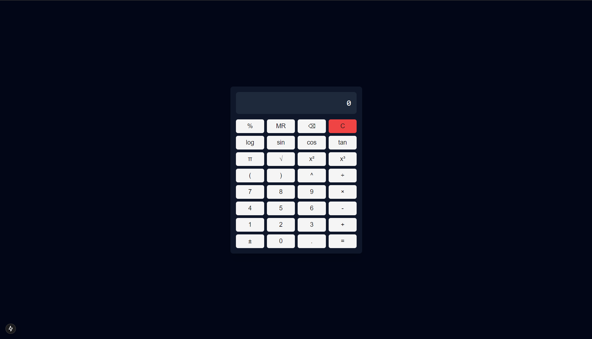

# Next.js Scientific Calculator



A modern, feature-rich scientific calculator built with Next.js 14, TypeScript, Tailwind CSS, and shadcn/ui. This calculator combines elegant design with powerful functionality, offering both basic arithmetic and advanced scientific operations.

## ✨ Features

### Basic Operations

- ➕ Addition
- ➖ Subtraction
- ✖️ Multiplication
- ➗ Division
- 🔢 Decimal numbers
- ±️ Positive/negative toggle

### Scientific Functions

- 📐 Trigonometric functions (sin, cos, tan)
- 📊 Logarithmic calculations
- 🔲 Square and cube functions
- √ Square root
- π Pi constant
- ^ Power operations

### User Experience

- ⌨️ Full keyboard support
- 🔙 Backspace functionality
- 🧹 Clear function (C)
- 🎯 Responsive design
- 🌓 Dark mode UI

## 🚀 Quick Start

### Prerequisites

- Node.js 16.8 or later
- npm or yarn or pnpm

### Installation

1. Clone the repository:

```bash
git clone https://github.com/MuhidinM/scientific-calculator
```

2. Install dependencies:

```bash
npm install
# or
yarn install
# or
pnpm install
```

3. Run the development server:

```bash
npm run dev
# or
yarn dev
# or
pnpm dev
```

4. Open [http://localhost:3000](http://localhost:3000) in your browser

## 🎮 Usage

### Keyboard Shortcuts

| Key         | Function          |
| ----------- | ----------------- |
| 0-9         | Numbers           |
| .           | Decimal point     |
| +           | Addition          |
| -           | Subtraction       |
| \* or x     | Multiplication    |
| /           | Division          |
| ^           | Power             |
| Enter or =  | Calculate         |
| Backspace   | Delete last digit |
| Escape or C | Clear all         |

### Scientific Function Shortcuts (with Alt key)

| Alt + Key | Function    |
| --------- | ----------- |
| Alt + L   | Logarithm   |
| Alt + S   | Sine        |
| Alt + O   | Cosine      |
| Alt + T   | Tangent     |
| Alt + P   | Pi          |
| Alt + R   | Square Root |
| Alt + Q   | Square      |
| Alt + U   | Cube        |

### Scientific Operations

- **Trigonometric Functions**: Click sin, cos, or tan buttons
- **Square/Cube**: Use x² or x³ buttons
- **Square Root**: Click √ button
- **Logarithm**: Use log button
- **Pi Constant**: Click π button
- **Power**: Use ^ button

## 🛠️ Built With

- [Next.js 14](https://nextjs.org/) - React framework
- [TypeScript](https://www.typescriptlang.org/) - Type safety
- [Tailwind CSS](https://tailwindcss.com/) - Styling
- [shadcn/ui](https://ui.shadcn.com/) - UI components

## 📱 Responsive Design

The calculator is fully responsive and works on:

- 💻 Desktop
- 📱 Mobile devices
- 📟 Tablets

## 🔧 Customization

### Theme Modification

The calculator uses Tailwind CSS for styling. You can modify the appearance by:

1. Adjusting colors in `tailwind.config.js`
2. Modifying component styles in the Calculator component
3. Customizing shadcn/ui theme variables

### Adding New Functions

To add new scientific functions:

1. Add new button to `scientificButtons` array
2. Implement handler in `handleScientific` function
3. Add corresponding keyboard shortcut if needed

## 🤝 Contributing

Contributions are welcome! Please feel free to submit a Pull Request.

1. Fork the project
2. Create your feature branch (`git checkout -b feature/AmazingFeature`)
3. Commit your changes (`git commit -m 'Add some AmazingFeature'`)
4. Push to the branch (`git push origin feature/AmazingFeature`)
5. Open a Pull Request

## 📝 License

This project is licensed under the MIT License - see the [LICENSE.md](LICENSE.md) file for details

## 🙏 Acknowledgments

- [Next.js team](https://nextjs.org/)
- [shadcn](https://ui.shadcn.com/) for the amazing UI components
- [Tailwind CSS](https://tailwindcss.com/) team

## 📧 Contact

Muhidin Misbah - [@Telegram](https://t.me/muhidinmisbah)

Project Link: [https://github.com/MuhidinM/scientific-calculator](https://github.com/MuhidinM/scientific-calculator)

---

Made with ❤️ using Next.js
